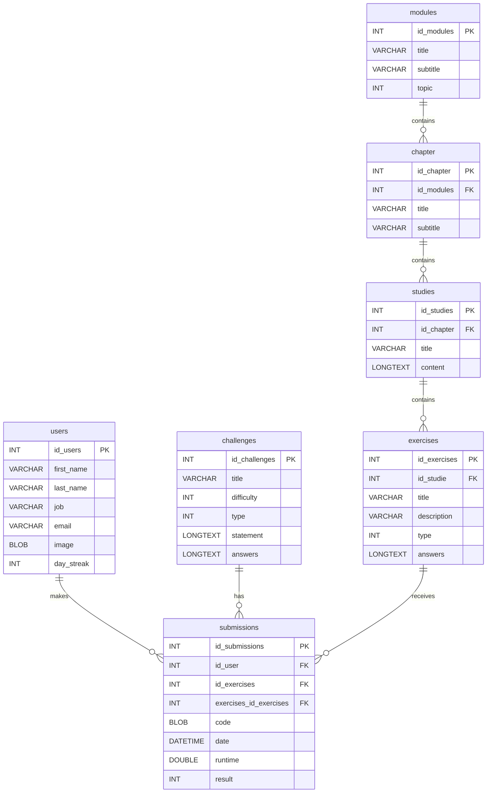

# Diagrama entidade relacionamento

```mermaid
erDiagram
    users {
        INT id_users PK
        VARCHAR first_name
        VARCHAR last_name
        VARCHAR job
        VARCHAR email
        BLOB image
        INT day_streak
    }

    challenges {
        INT id_challenges PK
        VARCHAR title
        INT difficulty
        INT type
        LONGTEXT statement
        LONGTEXT answers
    }

    submissions {
        INT id_submissions PK
        INT id_user FK
        INT id_exercises FK
        INT exercises_id_exercises FK
        BLOB code
        DATETIME date
        DOUBLE runtime
        INT result
    }

    exercises {
        INT id_exercises PK
        INT id_studie FK
        VARCHAR title
        VARCHAR description
        INT type
        LONGTEXT answers
    }

    studies {
        INT id_studies PK
        INT id_chapter FK
        VARCHAR title
        LONGTEXT content
    }

    chapter {
        INT id_chapter PK
        INT id_modules FK
        VARCHAR title
        VARCHAR subtitle
    }

    modules {
        INT id_modules PK
        VARCHAR title
        VARCHAR subtitle
        INT topic
    }

    users ||--o{ submissions : "makes"
    challenges ||--o{ submissions : "has"
    exercises ||--o{ submissions : "receives"
    studies ||--o{ exercises : "contains"
    chapter ||--o{ studies : "contains"
    modules ||--o{ chapter : "contains"
```