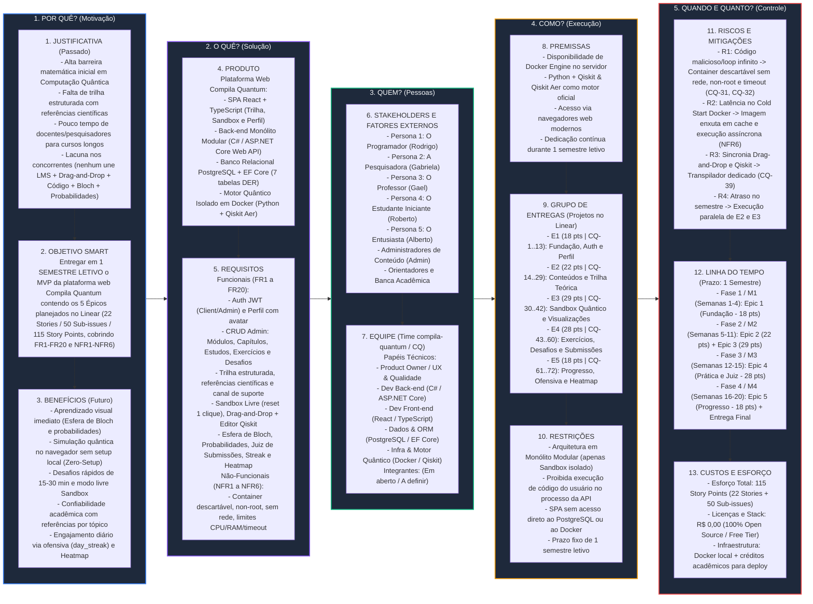
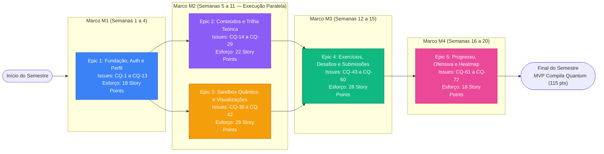

# Project Model Canvas (PMC) — Compila Quantum

## 1. Quadro Visual do Project Model Canvas (13 Blocos)

```mermaid
flowchart LR
    subgraph COL1["1. POR QUÊ? (Motivação)"]
        direction TB
        B1["1. JUSTIFICATIVA (Passado)
        - Alta barreira matemática inicial em Computação Quântica
        - Falta de trilha estruturada com referências científicas
        - Pouco tempo de docentes/pesquisadores para cursos longos
        - Lacuna nos concorrentes (nenhum une LMS + Drag-and-Drop + Código + Bloch + Probabilidades)"]

        B2["2. OBJETIVO SMART
        Entregar em 1 SEMESTRE LETIVO o MVP da plataforma web Compila Quantum contendo os 5 Épicos planejados no Linear (22 Stories / 50 Sub-issues / 115 Story Points, cobrindo FR1-FR20 e NFR1-NFR6)"]

        B3["3. BENEFÍCIOS (Futuro)
        - Aprendizado visual imediato (Esfera de Bloch e probabilidades)
        - Simulação quântica no navegador sem setup local (Zero-Setup)
        - Desafios rápidos de 15-30 min e modo livre Sandbox
        - Confiabilidade acadêmica com referências por tópico
        - Engajamento diário via ofensiva (day_streak) e Heatmap"]

        B1 --> B2 --> B3
    end

    subgraph COL2["2. O QUÊ? (Solução)"]
        direction TB
        B4["4. PRODUTO
        Plataforma Web Compila Quantum:
        - SPA React + TypeScript (Trilha, Sandbox e Perfil)
        - Back-end Monólito Modular (C# / ASP.NET Core Web API)
        - Banco Relacional PostgreSQL + EF Core (7 tabelas DER)
        - Motor Quântico Isolado em Docker (Python + Qiskit Aer)"]

        B5["5. REQUISITOS
        Funcionais (FR1 a FR20):
        - Auth JWT (Client/Admin) e Perfil com avatar
        - CRUD Admin: Módulos, Capítulos, Estudos, Exercícios e Desafios
        - Trilha estruturada, referências científicas e canal de suporte
        - Sandbox Livre (reset 1 clique), Drag-and-Drop + Editor Qiskit
        - Esfera de Bloch, Probabilidades, Juiz de Submissões, Streak e Heatmap
        Não-Funcionais (NFR1 a NFR6):
        - Container descartável, non-root, sem rede, limites CPU/RAM/timeout"]

        B4 --> B5
    end

    subgraph COL3["3. QUEM? (Pessoas)"]
        direction TB
        B6["6. STAKEHOLDERS E FATORES EXTERNOS
        - Persona 1: O Programador (Rodrigo)
        - Persona 2: A Pesquisadora (Gabriela)
        - Persona 3: O Professor (Gael)
        - Persona 4: O Estudante Iniciante (Roberto)
        - Persona 5: O Entusiasta (Alberto)
        - Administradores de Conteúdo (Admin)
        - Orientadores e Banca Acadêmica"]

        B7["7. EQUIPE (Time compila-quantum / CQ)
        Papéis Técnicos:
        - Product Owner / UX & Qualidade
        - Dev Back-end (C# / ASP.NET Core)
        - Dev Front-end (React / TypeScript)
        - Dados & ORM (PostgreSQL / EF Core)
        - Infra & Motor Quântico (Docker / Qiskit)
        Integrantes: (Em aberto / A definir)"]

        B6 --> B7
    end

    subgraph COL4["4. COMO? (Execução)"]
        direction TB
        B8["8. PREMISSAS
        - Disponibilidade de Docker Engine no servidor
        - Python + Qiskit & Qiskit Aer como motor oficial
        - Acesso via navegadores web modernos
        - Dedicação contínua durante 1 semestre letivo"]

        B9["9. GRUPO DE ENTREGAS (Projetos no Linear)
        - E1 (18 pts | CQ-1..13): Fundação, Auth e Perfil
        - E2 (22 pts | CQ-14..29): Conteúdos e Trilha Teórica
        - E3 (29 pts | CQ-30..42): Sandbox Quântico e Visualizações
        - E4 (28 pts | CQ-43..60): Exercícios, Desafios e Submissões
        - E5 (18 pts | CQ-61..72): Progresso, Ofensiva e Heatmap"]

        B10["10. RESTRIÇÕES
        - Arquitetura em Monólito Modular (apenas Sandbox isolado)
        - Proibida execução de código do usuário no processo da API
        - SPA sem acesso direto ao PostgreSQL ou ao Docker
        - Prazo fixo de 1 semestre letivo"]

        B8 --> B9 --> B10
    end

    subgraph COL5["5. QUANDO E QUANTO? (Controle)"]
        direction TB
        B11["11. RISCOS E MITIGAÇÕES
        - R1: Código malicioso/loop infinito -> Container descartável sem rede, non-root e timeout (CQ-31, CQ-32)
        - R2: Latência no Cold Start Docker -> Imagem enxuta em cache e execução assíncrona (NFR6)
        - R3: Sincronia Drag-and-Drop e Qiskit -> Transpilador dedicado (CQ-39)
        - R4: Atraso no semestre -> Execução paralela de E2 e E3"]

        B12["12. LINHA DO TEMPO (Prazo: 1 Semestre)
        - Fase 1 / M1 (Semanas 1-4): Epic 1 (Fundação - 18 pts)
        - Fase 2 / M2 (Semanas 5-11): Epic 2 (22 pts) + Epic 3 (29 pts)
        - Fase 3 / M3 (Semanas 12-15): Epic 4 (Prática e Juiz - 28 pts)
        - Fase 4 / M4 (Semanas 16-20): Epic 5 (Progresso - 18 pts) + Entrega Final"]

        B13["13. CUSTOS E ESFORÇO
        - Esforço Total: 115 Story Points (22 Stories + 50 Sub-issues)
        - Licenças e Stack: R$ 0,00 (100% Open Source / Free Tier)
        - Infraestrutura: Docker local + créditos acadêmicos para deploy"]

        B11 --> B12 --> B13
    end

    COL1 --> COL2 --> COL3 --> COL4 --> COL5

    style COL1 fill:#1e293b,stroke:#3b82f6,stroke-width:2px,color:#f8fafc
    style COL2 fill:#1e293b,stroke:#8b5cf6,stroke-width:2px,color:#f8fafc
    style COL3 fill:#1e293b,stroke:#10b981,stroke-width:2px,color:#f8fafc
    style COL4 fill:#1e293b,stroke:#f59e0b,stroke-width:2px,color:#f8fafc
    style COL5 fill:#1e293b,stroke:#ef4444,stroke-width:2px,color:#f8fafc
```

---

## 2. Fluxo de Entregas e Cronograma de 1 Semestre (Roadmap Linear)

```mermaid
flowchart LR
    START(["Início do Semestre"]) --> M1

    subgraph M1["Marco M1 (Semanas 1 a 4)"]
        E1["Epic 1: Fundação, Auth e Perfil
        Issues: CQ-1 a CQ-13
        Esforço: 18 Story Points"]
    end

    subgraph M2["Marco M2 (Semanas 5 a 11 — Execução Paralela)"]
        direction TB
        E2["Epic 2: Conteúdos e Trilha Teórica
        Issues: CQ-14 a CQ-29
        Esforço: 22 Story Points"]
        E3["Epic 3: Sandbox Quântico e Visualizações
        Issues: CQ-30 a CQ-42
        Esforço: 29 Story Points"]
    end

    subgraph M3["Marco M3 (Semanas 12 a 15)"]
        E4["Epic 4: Exercícios, Desafios e Submissões
        Issues: CQ-43 a CQ-60
        Esforço: 28 Story Points"]
    end

    subgraph M4["Marco M4 (Semanas 16 a 20)"]
        E5["Epic 5: Progresso, Ofensiva e Heatmap
        Issues: CQ-61 a CQ-72
        Esforço: 18 Story Points"]
    end

    E1 --> E2
    E1 --> E3
    E2 --> E4
    E3 --> E4
    E4 --> E5
    E5 --> END(["Final do Semestre
    MVP Compila Quantum (115 pts)"])

    style E1 fill:#3b82f6,stroke:#1d4ed8,color:#ffffff
    style E2 fill:#8b5cf6,stroke:#6d28d9,color:#ffffff
    style E3 fill:#f59e0b,stroke:#b45309,color:#ffffff
    style E4 fill:#10b981,stroke:#047857,color:#ffffff
    style E5 fill:#ec4899,stroke:#be185d,color:#ffffff
```
